# Introduction

A discharge rating curve is a model that describes the relationship
between water elevation and discharge in a river. The rating curve is
estimated from paired observations of water elevation and discharge and
it is used to predict discharge for a given water elevation. This is the
main practical usage of rating curves, as water elevation is
substantially easier to directly observe than discharge. This R package
implements four different discharge rating curve models using a Bayesian
hierarchical modeling framework:

- [`plm0()`](https://sor16.github.io/bdrc/reference/plm0.md) - Power-law
  model with constant log-error variance.

- [`plm()`](https://sor16.github.io/bdrc/reference/plm.md) - Power-law
  model with stage-dependent log-error variance.

- [`gplm0()`](https://sor16.github.io/bdrc/reference/gplm0.md) -
  Generalized power-law model with constant log-error variance.

- [`gplm()`](https://sor16.github.io/bdrc/reference/gplm.md) -
  Generalized power-law model with stage-dependent log-error variance.

For further details about the different models, see Hrafnkelsson et
al. (2022). For an brief overview of the underlying theory, see our
[Background](https://sor16.github.io/bdrc/articles/background.html)
vignette.

The models differ in their complexity, `gplm` being the most flexible
and complex model. We will focus on the use of `gplm` throughout this
introduction vignette and explore the different ways to fit the `gplm`
and visualize its output. However, the API of the functions for the
other three models are almost identical so this vignette also helps
users to run those models.

``` r
> library(bdrc)
> set.seed(1) #set seed for reproducibility
```

We will use a dataset from a stream gauging station in Sweden, called
Krokfors, that comes with the package:

``` r
> data(krokfors)
> head(krokfors)
#>          W          Q
#> 1 9.478000 10.8211700
#> 2 8.698000  1.5010000
#> 3 9.009000  3.3190000
#> 4 8.097000  0.1595700
#> 5 9.104000  4.5462500
#> 6 8.133774  0.2121178
```

## Fitting a discharge rating curve

Fitting a discharge rating curve with `bdrc` is straightforward. Only
two input arguments are mandatory: `formula` and `data`. The `formula`
should of the form `y ~ x`, where `y` is the discharge in cubic meters
per second (m³/s), and `x` is the water elevation (stage) in meters (m).
It is crucial that the data is in the correct units! The `data` argument
must be a `data.frame` including `x` and `y` as column names. In our
case, the Krokfors data has the discharge and water elevation
measurements stored in columns named `Q` and `W`, respectively. We are
ready to fit a discharge rating curve using the `gplm` function:

``` r
> gplm.fit <- gplm(Q ~ W, data = krokfors, parallel = TRUE, num_cores = 2)
#> Progress:
#> Initializing Metropolis MCMC algorithm...
#> Multiprocess sampling (4 chains in 2 jobs) ...
#> 
#> MCMC sampling completed!
#> 
#> Diagnostics:
#> Acceptance rate: 25.33%.
#> ✔ All chains have mixed well (Rhat < 1.1).
#> ✔ Effective sample sizes sufficient (eff_n_samples > 400).
```

The function prints out a summary of the fitting process and key MCMC
diagnostics. These include the acceptance rate, chain mixing (assessed
via the Gelman-Rubin statistic, $\widehat{R}$), and effective sample
sizes. The checkmarks indicate that the algorithm has met important
criteria for reliability. However, sometimes you may encounter warnings.
For example:

    #> ⚠ Warning: Some chains are not mixing well. Parameters with Rhat > 1.1:
    #>   - sigma_eta: Rhat = 1.281

This warning suggests that certain parameters (in this case, sigma_eta)
haven’t mixed well across chains, which could affect the reliability of
the results. In such cases, the function provides advice:

    #> ℹ Try re-running the model after inspecting the trace plots, convergence diagnostics plots, and reviewing the data for potential issues.

This output helps you assess whether the discharge rating curve has been
fitted successfully and reliably using the specified data. The function
can be made to run silently by setting `verbose=FALSE`.

Note that `parallel=TRUE` is the default setting, utilizing all
available cores on the machine. You can adjust the number of cores with
the `num_cores` argument if needed.

The `gplm` function returns an object of class *gplm* which we can
summarize and visualize using familiar functions such as

``` r
> summary(gplm.fit)
#> 
#> Formula: 
#>  Q ~ W
#> Latent parameters:
#>   lower-2.5% median-50% upper-97.5%
#> a 1.47       1.94       2.23       
#> b 1.83       1.84       1.84       
#> 
#> Hyperparameters:
#>            lower-2.5% median-50% upper-97.5%
#> c           7.70955    7.8089     7.855     
#> sigma_beta  0.42275    0.6942     1.258     
#> phi_beta    0.54941    1.1775     2.861     
#> sigma_eta   0.00298    0.0934     0.498     
#> eta_1      -4.91521   -4.2508    -3.535     
#> eta_2      -5.97953   -4.0555    -2.264     
#> eta_3      -6.92387   -4.1874    -1.612     
#> eta_4      -7.66667   -4.4852    -1.160     
#> eta_5      -8.33270   -4.6095    -0.757     
#> eta_6      -8.81259   -4.6718    -0.311     
#> 
#> WAIC: -27.81763
```

and

``` r
> plot(gplm.fit)
```

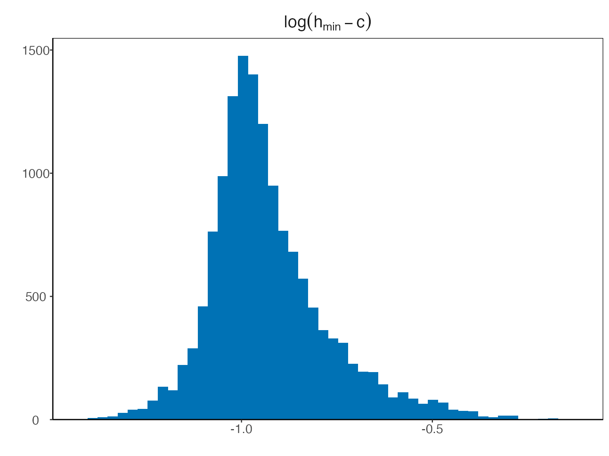

In the next section, we will dive deeper into visualizing the *gplm*
object.

## Visualizing posterior distributions of different parameters

The `bdrc` package provides several tools to visualize the results from
model objects which can give insight into the physical properties of the
river at hand. For instance, the hyperparameter $c$ corresponds to the
water elevation of zero discharge. To visualize the posterior of $c$, we
can write

``` r
> plot(gplm.fit, type = 'histogram', param = 'c')
```

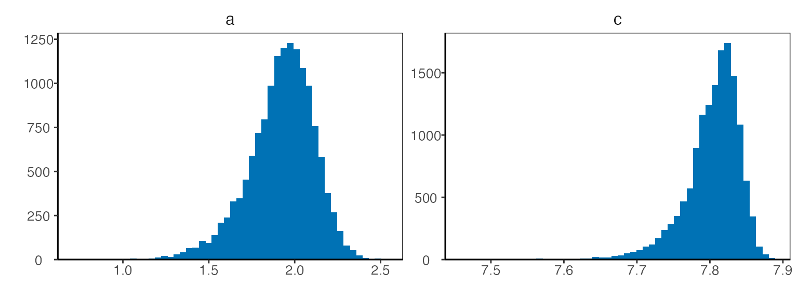

Technically, instead of inferring $c$ directly, $h_{min} - c$ is
inferred, where $h_{min}$ is the lowest water elevation value in the
data. Since the parameter $h_{min} - c$ is strictly positive, a
transformation $\zeta = log\left( h_{min} - c \right)$ is used for the
Bayesian inference so that it has support on the real line. To plot the
transformed posterior we write

``` r
> plot(gplm.fit, type = 'histogram', param = 'c', transformed = TRUE)
```

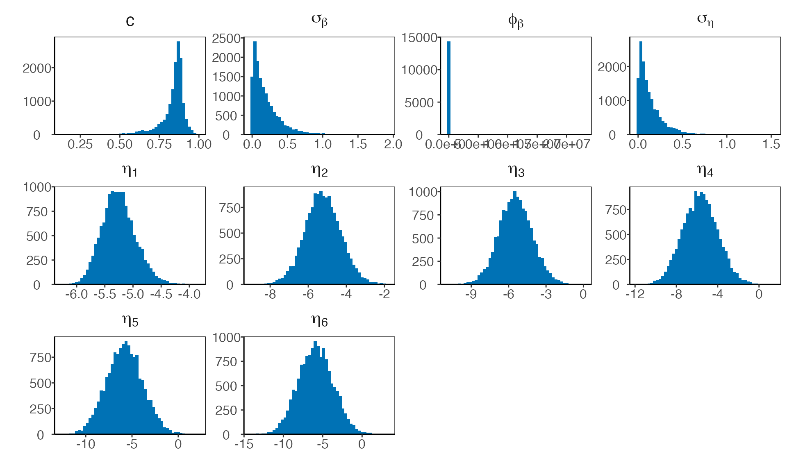

The `param` argument can also be a vector containing multiple parameter
names. For example, to visualize the posterior distributions of the
parameters $a$ and $c$, we can write

``` r
> plot(gplm.fit, type = 'histogram', param = c('a', 'c'))
```

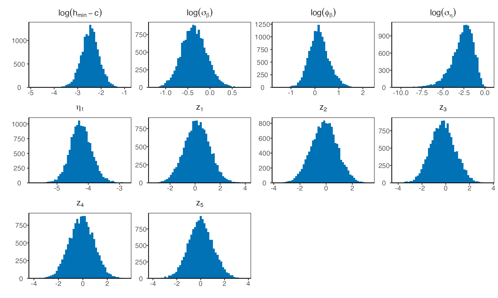

There is a shorthand to visualize the hyperparameters all at once

``` r
> plot(gplm.fit, type = 'histogram', param = 'hyperparameters')
```

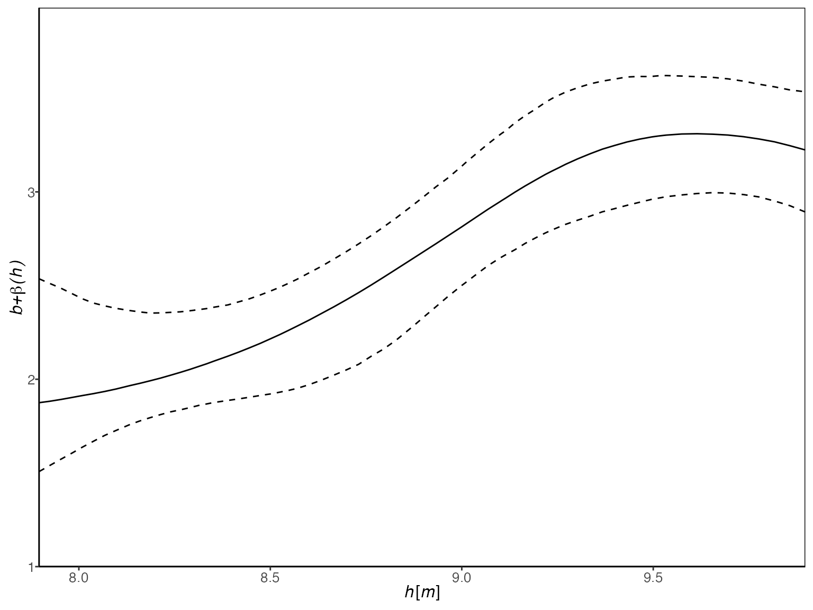

Similarly, writing `"latent_parameters"` plots the latent parameters in
one plot. To plot the hyperparameters transformed on the same scale as
in the Bayesian inference, we write

``` r
> plot(gplm.fit, type = 'histogram', param = 'hyperparameters', transformed = TRUE)
```

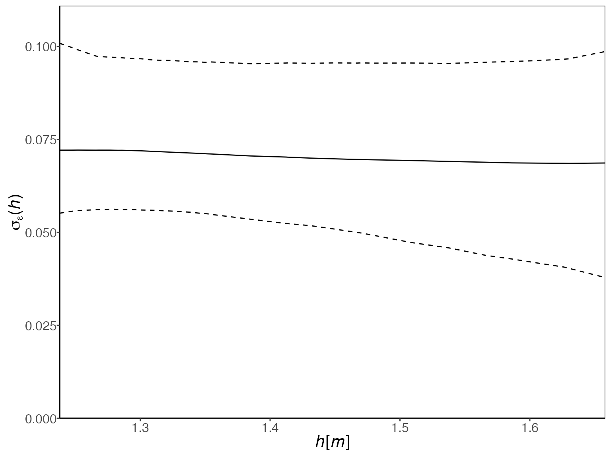

Finally, we can visualize the components of the model that are allowed
(depending on the model) to vary with water elevation, that is, the
power-law exponent, $f(h)$, and the standard deviation of the error
terms at the response level, $\sigma_{\varepsilon}(h)$. Both `gplm0` and
`gplm` generalize the power-law exponent by modeling it as a sum of a
constant term, $b$, and Gaussian process, $\beta(h)$, namely
$f(h) = b + \beta(h)$, where $\beta(h)$ is assumed to be twice
differentiable with mean zero. On the other hand, `plm` and `plm0` both
model the power-law exponent as a constant by setting $\beta(h) = 0$,
which gives $f(h) = b$. We can plot the inferred power-law exponent with

``` r
> plot(gplm.fit, type = 'f')
```

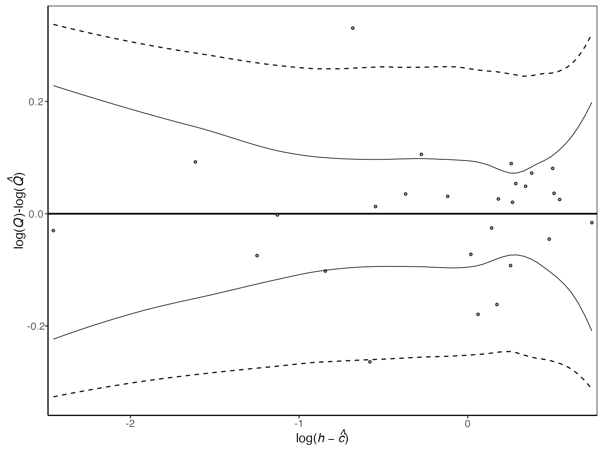

Both `plm` and `gplm` model the standard deviation of the error terms at
the response level, $\sigma_{\varepsilon}(h)$, as a function of water
elevation, using B-splines basis functions, while `plm0` and `gplm0`
model the standard deviation as a constant. We can plot the inferred
standard deviation by writing

``` r
> plot(gplm.fit, type = 'sigma_eps')
```

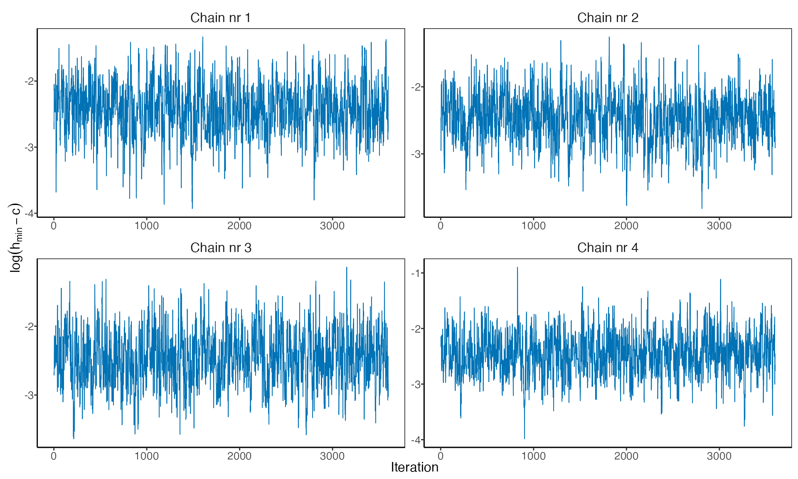

To get a visual summary of your model, the `"panel"` option in the plot
type is useful:

``` r
> plot(gplm.fit, type = 'panel', transformed = TRUE)
```

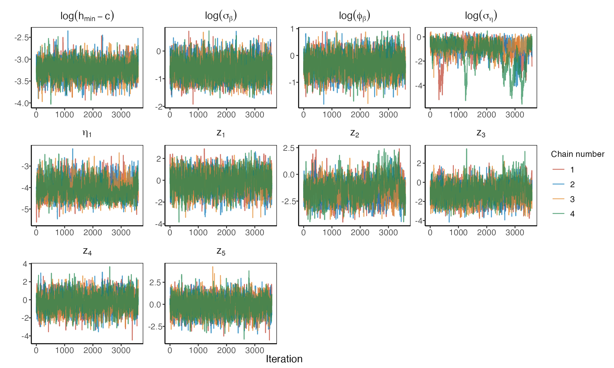

## Assessing model fit and convergence

The package has several functions for convergence diagnostics of a
`bdrc` model, most notably the residual plot, trace plots,
autocorrelation plots, and Gelman-Rubin diagnostic plots. The
log-residuals can be plotted with

``` r
> plot(gplm.fit, type = 'residuals')
```

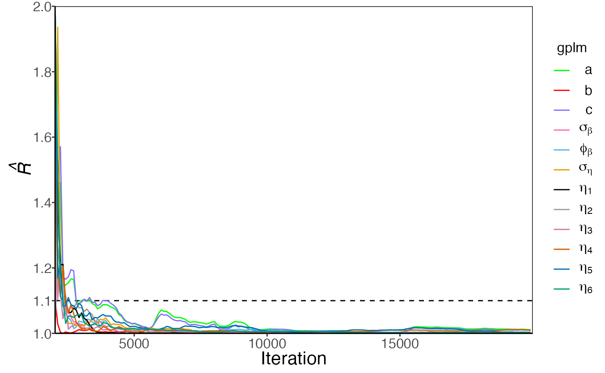

The log-residuals are calculated by subtracting the posterior estimate
(median) of the log-discharge, $log\left( \widehat{Q} \right)$, from the
observed log-discharge, $log(Q)$. Additionally, the plot includes the
95% predictive intervals of $\log(Q)$ (- -) and 95% credible intervals
for the expected value of $\log(Q)$ (—), the latter reflecting the
rating curve uncertainty.

``` r
> plot(gplm.fit, type = 'trace', param = 'c', transformed = TRUE)
```


To plot a trace plot for all the transformed hyperparameters, we write

``` r
> plot(gplm.fit, type = 'trace', param = 'hyperparameters', transformed = TRUE)
```

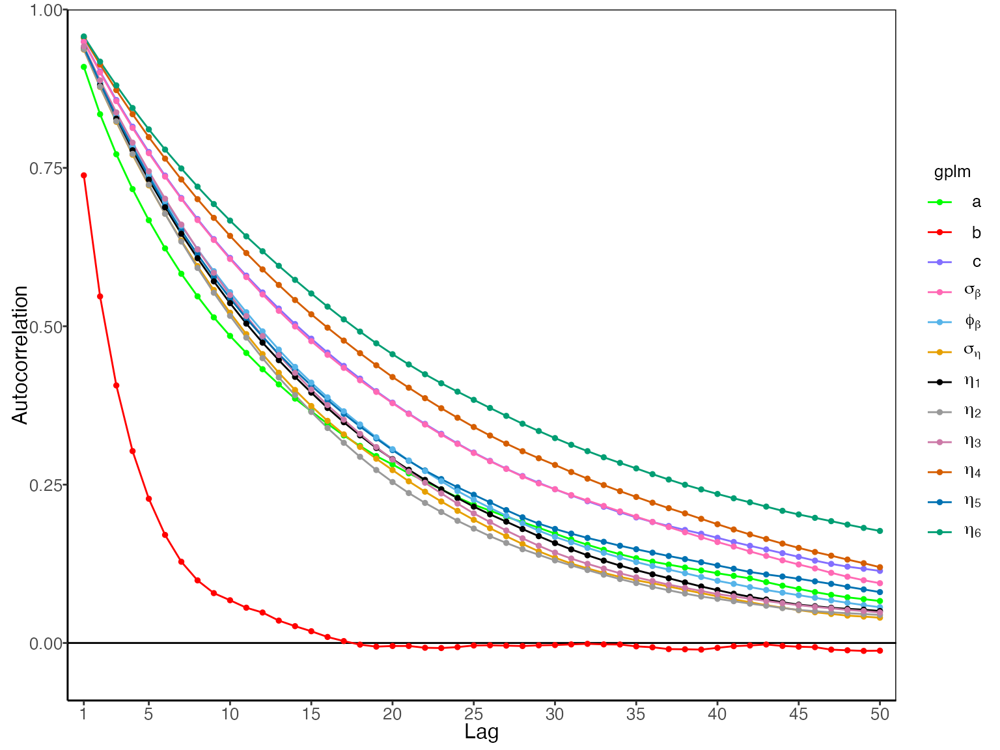

To assess the mixing and convergence of the MCMC chains for each
parameter, you can visualize the Gelman-Rubin statistic, $\widehat{R}$,
as presented by Gelman and Rubin (1992) with:

``` r
> plot(gplm.fit, type = 'r_hat')
```

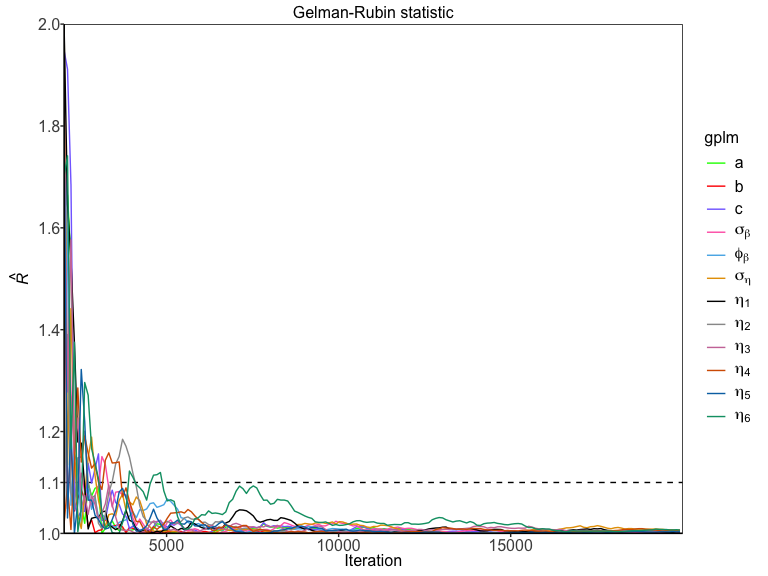

And finally, autocorrelation of parameters can be assessed with

``` r
> plot(gplm.fit, type = 'autocorrelation')
```

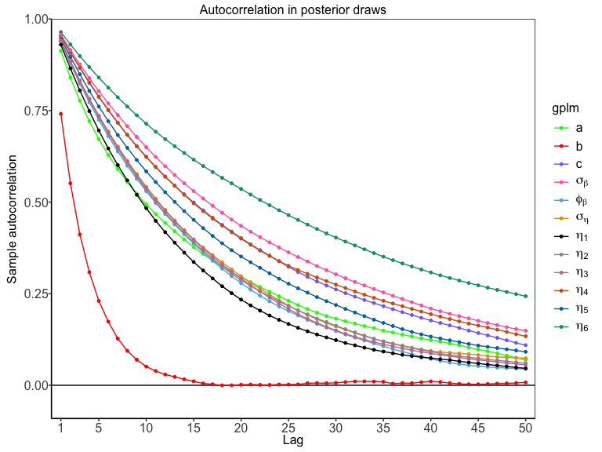

## Customizing the models

There are ways to further customize the `gplm` function. In some
instances, the parameter of zero discharge, $c$, is known, and you might
want to fix the model parameter to the known value. In addition, you
might want to extrapolate the rating curve to higher water elevation
values by adjusting the maximum water elevation. Assume 7.65 m is the
known value of $c$ and you want to calculate the rating curve for water
elevation values up to 10 m, then your function call would look like
this

``` r
> gplm.fit.known_c <- gplm(Q ~ W, krokfors, c_param = 7.65, h_max = 10, parallel = FALSE)
```

## Prediction for an equally spaced grid of water elevations

To get rating curve predictions for an equally spaced grid of water
elevation values, you can use the predict function. Note that only
values in the range from $c$ and h_max are accepted, as that is the
range in which the Bayesian inference was performed

``` r
> h_grid <- seq(8, 8.2, by = 0.01)
> rating_curve_h_grid <- predict(gplm.fit, newdata = h_grid)
> print(rating_curve_h_grid)
#>       h      lower     median     upper
#> 1  8.00 0.06138853 0.08252241 0.1108601
#> 2  8.01 0.06708762 0.09009315 0.1207313
#> 3  8.02 0.07340524 0.09850833 0.1316830
#> 4  8.03 0.07972287 0.10692352 0.1426346
#> 5  8.04 0.08620981 0.11547827 0.1537808
#> 6  8.05 0.09363849 0.12480929 0.1660087
#> 7  8.06 0.10106716 0.13414031 0.1782366
#> 8  8.07 0.10861541 0.14364701 0.1906011
#> 9  8.08 0.11657272 0.15375469 0.2034327
#> 10 8.09 0.12453003 0.16386237 0.2162643
#> 11 8.10 0.13257127 0.17428375 0.2295414
#> 12 8.11 0.14080833 0.18543710 0.2438577
#> 13 8.12 0.14904540 0.19659045 0.2581741
#> 14 8.13 0.15728247 0.20774380 0.2724905
#> 15 8.14 0.16662200 0.21960922 0.2875367
#> 16 8.15 0.17662981 0.23190628 0.3030253
#> 17 8.16 0.18663761 0.24420333 0.3185138
#> 18 8.17 0.19681441 0.25692028 0.3351942
#> 19 8.18 0.20699699 0.26965158 0.3519154
#> 20 8.19 0.21718541 0.28270330 0.3691020
#> 21 8.20 0.22738677 0.29646391 0.3873183
```

## References

Gelman, A., & Rubin, D. B. (1992). *Inference from iterative simulation
using multiple sequences*, Statistical Science, 7(4), 457–472. doi:
<https://doi.org/10.1214/ss/1177011136>

Hrafnkelsson, B., Sigurdarson, H., Rögnvaldsson, S., Jansson, A. Ö.,
Vias, R. D., and Gardarsson, S. M. (2022). *Generalization of the
power-law rating curve using hydrodynamic theory and Bayesian
hierarchical modeling*, Environmetrics, 33(2):e2711. doi:
<https://doi.org/10.1002/env.2711>
