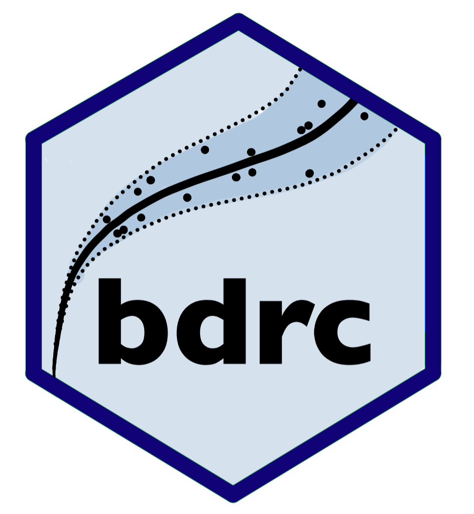

## bdrc - Bayesian Discharge Rating Curves 

The `bdrc` package provides tools for fitting discharge rating curves
using Bayesian hierarchical models. It implements both the classical
power-law and the novel generalized power-law models, offering
flexibility in handling various hydrological scenarios.

This package implements four models as described in Hrafnkelsson et
al. (2022):

- [`plm0()`](https://sor16.github.io/bdrc/reference/plm0.md) - Power-law
  model with constant log-error variance.

- [`plm()`](https://sor16.github.io/bdrc/reference/plm.md) - Power-law
  model with stage-dependent log-error variance.

- [`gplm0()`](https://sor16.github.io/bdrc/reference/gplm0.md) -
  Generalized power-law model with constant log-error variance.

- [`gplm()`](https://sor16.github.io/bdrc/reference/gplm.md) -
  Generalized power-law model with stage-dependent log-error variance.

## Installation

``` r
# Install release version from CRAN
install.packages("bdrc")
# Install development version from GitHub
devtools::install_github("sor16/bdrc")
```

## Usage

Fitting a discharge rating curve with bdrc is straightforward:

``` r
library(bdrc)
data(krokfors)
gplm.fit <- gplm(Q ~ W, krokfors)
summary(gplm.fit)
plot(gplm.fit)
```

## Key-features

- Easy-to-use interface for fitting Bayesian discharge rating curves
- Features the novel Generalized power-law rating curve model
  (Hrafnkelsson et al., 2022)
- Multiple model options to suit different hydrological scenarios
- Built-in visualization tools for model results and diagnostics
- Integrates R and C++ for efficient MCMC sampling with parallel
  processing

## Getting started

For a deeper dive into the package’s functionality, visualization
options, and the underlying theory of the models, please check out our
vignettes:

- [Background](https://sor16.github.io/bdrc/articles/background.html)
- [Introduction](https://sor16.github.io/bdrc/articles/introduction.html)
- [Power-law tournament (model
  selection)](https://sor16.github.io/bdrc/articles/tournament.html)

## References

Hrafnkelsson, B., Sigurdarson, H., Rögnvaldsson, S., Jansson, A. Ö.,
Vias, R. D., and Gardarsson, S. M. (2022). *Generalization of the
power-law rating curve using hydrodynamic theory and Bayesian
hierarchical modeling*, Environmetrics, 33(2):e2711. doi:
<https://doi.org/10.1002/env.2711>
